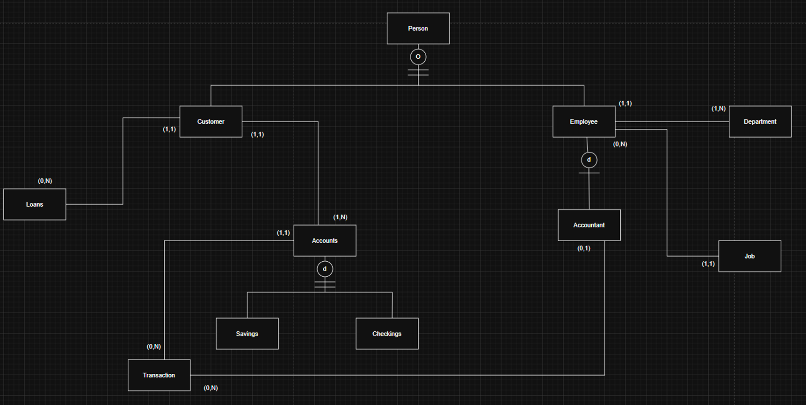
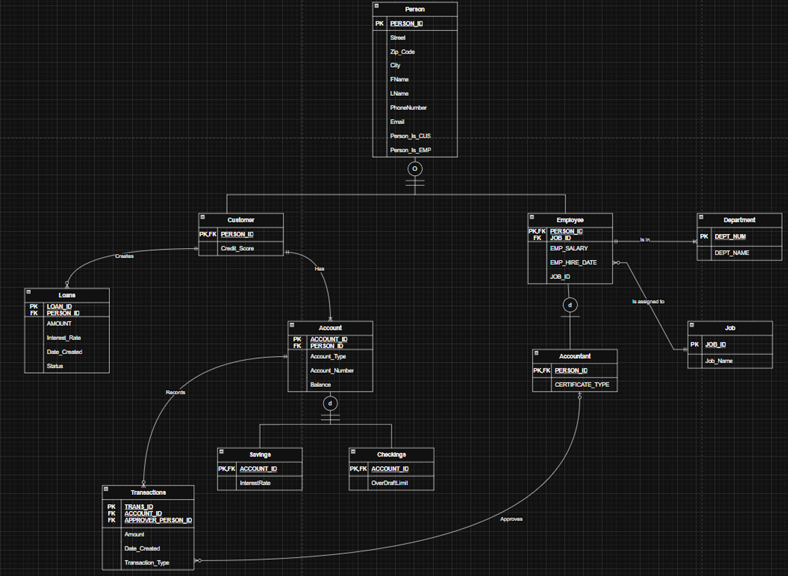
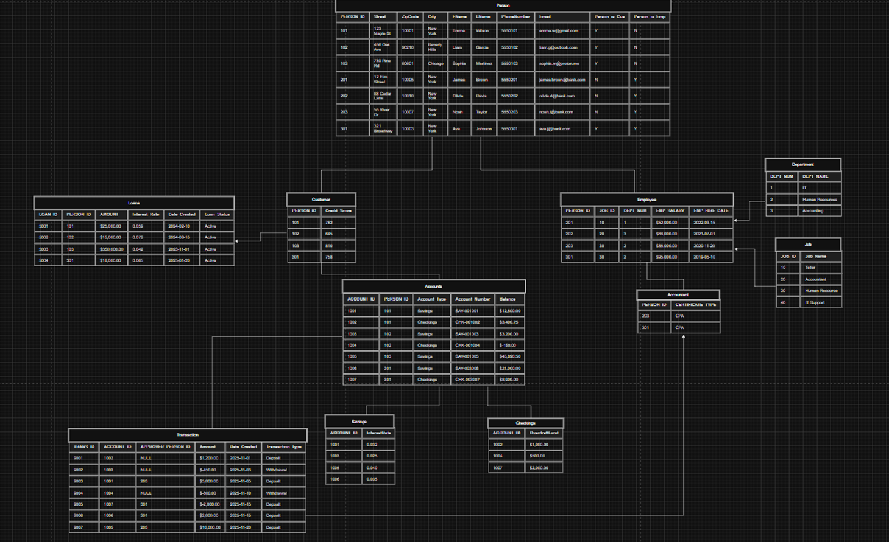

# Banking System Database

A relational database project modeling a retail banking system, including customers, employees, accounts, loans, and transactions. Built to demonstrate schema design (including supertype/subtype relationships), normalization, and SQL querying.

> ⚠️ **Note:** All data used in this project is entirely fictional and generated for demonstration purposes only. Any resemblance to real persons, companies, or events is purely coincidental.

---

## Repo Structure

```
├── Banking_Database.sql          -- full schema
├── ERD.png                       -- entity-relationship diagram (conceptual model, crow's-foot notation)
├── README.md
├── Relational_Table.png          -- table structure
└── Relational_Database_Model.png -- relational schema mapped to tables, PKs, and FKs
```

## Entity-Relationship Diagram



## Relational Database Model



## Relational Table


---

## Business Rules

| # | Rule |
|---|------|
| 1 | A Person can be a customer and an employee (not mutually exclusive) |
| 2 | Each customer can have multiple accounts, but must have at least one |
| 3 | Every account is assigned to exactly one customer |
| 4 | Accounts must be a valid type: Savings or Checking (subtype) |
| 5 | A customer can apply for multiple loans; each loan belongs to exactly one customer |
| 6 | An accountant is a subtype of employee |
| 7 | An account can have 0 to many transactions; a transaction must belong to exactly one account |
| 8 | An accountant can approve 0 to many transactions; a transaction is approved by 0 or 1 accountant |
| 9 | A job can be worked by many employees; an employee works exactly 1 job |
| 10 | A department can have many employees; an employee belongs to exactly 1 department |

## Entities

| Entity | Key Attributes |
|---|---|
| **PERSON** | PERSON_ID (PK), Street, ZipCode, City, FName, LName, PhoneNumber, Email, Person_is_Cus, Person_is_Emp |
| **CUSTOMER** | PERSON_ID (PK, FK), Credit_Score |
| **EMPLOYEE** | PERSON_ID (PK, FK), JOB_ID (FK), DEPT_NUM (FK), EMP_SALARY, EMP_HIRE_DATE |
| **ACCOUNTANT** | PERSON_ID (PK, FK), CERTIFICATE_TYPE |
| **DEPARTMENT** | DEPT_NUM (PK), DEPT_NAME |
| **JOB** | JOB_ID (PK), Job_Name |
| **ACCOUNT** | ACCOUNT_ID (PK), PERSON_ID (FK), Account_Type, Account_Number, Balance |
| **SAVINGS** | ACCOUNT_ID (PK, FK), InterestRate |
| **CHECKINGS** | ACCOUNT_ID (PK, FK), OverdraftLimit |
| **LOANS** | LOAN_ID (PK), PERSON_ID (FK), AMOUNT, Interest_Rate, Date_Created, Loan_Status |
| **TRANSACTION** | TRANS_ID (PK), ACCOUNT_ID (FK), APPROVER_PERSON_ID (FK), Amount, Date_Created, Transaction_Type |

---

## Data Dictionary

### Person

| Attribute | Data Type | Length | Constraint | Description |
|---|---|---|---|---|
| PERSON_ID | INT | 4 | Primary Key | Unique identifier for every person |
| Street | VARCHAR | 100 | NOT NULL | Street address of the person |
| ZipCode | CHAR | 10 | NOT NULL | Postal/zip code |
| City | VARCHAR | 50 | NOT NULL | City of residence/work |
| FName | VARCHAR | 50 | NOT NULL | First name |
| LName | VARCHAR | 50 | NOT NULL | Last name |
| PhoneNumber | CHAR | 15 | NOT NULL | Phone number (stored without dashes/spaces) |
| Email | VARCHAR | 100 | NOT NULL | Email address |
| Person_is_Cus | CHAR | 1 | NOT NULL, CHECK IN ('Y','N') | Y = is a customer, N = not a customer |
| Person_is_Emp | CHAR | 1 | NOT NULL, CHECK IN ('Y','N') | Y = is an employee, N = not an employee |

### Customer

| Attribute | Data Type | Length | Constraint | Description |
|---|---|---|---|---|
| PERSON_ID | INT | 4 | Primary Key, Foreign Key → Person.PERSON_ID | Links customer record to their person record |
| Credit_Score | INT | 4 | NOT NULL, CHECK (300–850) | Customer's credit score |

### Employee

| Attribute | Data Type | Length | Constraint | Description |
|---|---|---|---|---|
| PERSON_ID | INT | 4 | Primary Key, Foreign Key → Person.PERSON_ID | Links employee record to their person record |
| JOB_ID | INT | 4 | Foreign Key → Job.JOB_ID | Job title/position of the employee |
| DEPT_NUM | INT | 4 | Foreign Key → Department.DEPT_NUM | Department the employee belongs to |
| EMP_SALARY | MONEY | 8 | — | Annual salary of the employee |
| EMP_HIRE_DATE | DATE | — | NOT NULL | Date employee was hired |

### Accountant

| Attribute | Data Type | Length | Constraint | Description |
|---|---|---|---|---|
| PERSON_ID | INT | 4 | Primary Key, Foreign Key → Employee.PERSON_ID | Links accountant record to their employee record |
| CERTIFICATE_TYPE | VARCHAR | 50 | — | Accountant certification (e.g., CPA) |

### Department

| Attribute | Data Type | Length | Constraint | Description |
|---|---|---|---|---|
| DEPT_NUM | INT | 4 | Primary Key | Unique department number |
| DEPT_NAME | VARCHAR | 100 | NOT NULL, UNIQUE | Name of the department |

### Job

| Attribute | Data Type | Length | Constraint | Description |
|---|---|---|---|---|
| JOB_ID | INT | 4 | Primary Key | Unique job identifier |
| Job_Name | VARCHAR | 100 | NOT NULL, UNIQUE | Job title (Teller, Loan Officer, etc.) |

### Account

| Attribute | Data Type | Length | Constraint | Description |
|---|---|---|---|---|
| ACCOUNT_ID | INT | 4 | Primary Key, Identity | Unique account identifier |
| PERSON_ID | INT | 4 | Foreign Key → Customer.PERSON_ID | Owner of the account (must be a customer) |
| Account_Type | VARCHAR | 20 | — | Savings or Checkings |
| Account_Number | VARCHAR | 20 | NOT NULL, UNIQUE | Human-readable account number |
| Balance | MONEY | 8 | DEFAULT 0 | Current balance |

### Savings

| Attribute | Data Type | Length | Constraint | Description |
|---|---|---|---|---|
| ACCOUNT_ID | INT | 4 | Primary Key, Foreign Key → Account.ACCOUNT_ID | Links to the parent account |
| InterestRate | DECIMAL | (4,3) | — | Annual interest rate for the savings account |

### Checkings

| Attribute | Data Type | Length | Constraint | Description |
|---|---|---|---|---|
| ACCOUNT_ID | INT | 4 | Primary Key, Foreign Key → Account.ACCOUNT_ID | Links to the parent account |
| OverdraftLimit | MONEY | 8 | — | Maximum allowed negative balance |

### Loans

| Attribute | Data Type | Length | Constraint | Description |
|---|---|---|---|---|
| LOAN_ID | INT | 4 | Primary Key, Identity | Unique loan identifier |
| PERSON_ID | INT | 4 | Foreign Key → Customer.PERSON_ID | Borrower (must be a customer) |
| AMOUNT | MONEY | 8 | NOT NULL | Loan principal amount |
| Interest_Rate | DECIMAL | (5,3) | — | Annual interest rate for the loan |
| Date_Created | DATE | — | — | Date the loan was issued |
| Loan_Status | VARCHAR | 20 | — | Active, Paid, Defaulted, etc. |

### Transactions

| Attribute | Data Type | Length | Constraint | Description |
|---|---|---|---|---|
| TRANS_ID | INT | 4 | Primary Key, Identity | Unique transaction identifier |
| ACCOUNT_ID | INT | 4 | Foreign Key → Account.ACCOUNT_ID | Account the transaction belongs to |
| APPROVER_PERSON_ID | INT | 4 | Foreign Key → Accountant.PERSON_ID (nullable) | Accountant who approved (if required) |
| Amount | MONEY | 8 | NOT NULL | Positive = deposit, negative = withdrawal |
| Date_Created | DATE | — | NOT NULL | Date of the transaction |
| Transaction_Type | VARCHAR | 20 | — | Deposit, Withdrawal, Transfer, etc. |

---

## Sample Queries

Below are some example queries demonstrating how to retrieve data from this banking database.

### 1. Total Loans Issued
Calculates the total amount of money loaned across all customers.

```sql
SELECT SUM(AMOUNT) AS Loans_By_All_Cust 
FROM Loans;
```

### 2. Average Salary by Department
Groups employees by their department name to find the average salary within each department.

```sql
SELECT D.DEPT_NAME, AVG(E.EMP_SALARY) AS Average_Salary
FROM Employee E 
JOIN Department D ON E.DEPT_NUM = D.DEPT_NUM
GROUP BY D.DEPT_NAME;
```

### 3. Customers with Overdrawn Accounts
Identifies accounts with a negative balance and returns the customer's full name, account number, and current balance.

```sql
SELECT P.FName, P.LName, A.Account_Number, A.Balance
FROM Account A 
JOIN Person P ON A.PERSON_ID = P.PERSON_ID
WHERE A.Balance < 0;
```

### 4. Approved Transactions Log
Retrieves details for all transactions that required administrative approval, joining the relevant tables to show both the customer's name and the approving accountant's name.

```sql
SELECT T.TRANS_ID, T.Amount, T.Date_Created, A.Account_Number,
    Cust.FName AS Customer_FName,
    Cust.LName AS Customer_LName,
    Appr.FName AS Approver_FName,
    Appr.LName AS Approver_LName
FROM Transactions T JOIN Account A 
ON T.ACCOUNT_ID = A.ACCOUNT_ID JOIN Person Cust 
ON A.PERSON_ID = Cust.PERSON_ID
JOIN Person Appr 
ON T.APPROVER_PERSON_ID = Appr.PERSON_ID
WHERE T.APPROVER_PERSON_ID IS NOT NULL;
```

### 5. Ranking Customers by Total Balance (Window Function)
Uses `RANK()` to rank each customer by the combined balance across all of their accounts.

```sql
SELECT 
    P.FName, 
    P.LName, 
    SUM(A.Balance) AS Total_Balance,
    RANK() OVER (ORDER BY SUM(A.Balance) DESC) AS Balance_Rank
FROM Account A
JOIN Person P ON A.PERSON_ID = P.PERSON_ID
GROUP BY P.FName, P.LName;
```

### 6. Accounts Above the Average Balance (Subquery)
Finds accounts whose balance is higher than the average balance across all accounts, useful for identifying high-value customers.

```sql
SELECT A.Account_Number, A.Account_Type, A.Balance, P.FName, P.LName
FROM Account A
JOIN Person P ON A.PERSON_ID = P.PERSON_ID
WHERE A.Balance > (SELECT AVG(Balance) FROM Account);
```

### 7. Unified Account View (Supertype/Subtype Join)
Combines `Account` with its `Savings` or `Checkings` subtype to show interest rate or overdraft limit in a single row, depending on account type.

```sql
SELECT 
    A.Account_Number, 
    A.Account_Type, 
    A.Balance,
    S.InterestRate,
    C.OverdraftLimit
FROM Account A
LEFT JOIN Savings S ON A.ACCOUNT_ID = S.ACCOUNT_ID
LEFT JOIN Checkings C ON A.ACCOUNT_ID = C.ACCOUNT_ID;
```

### 8. Loan-to-Credit-Score Ratio (CTE)
Uses a common table expression to calculate each customer's loan amount relative to their credit score, then filters for customers carrying relatively high loan burden for their credit tier.

```sql
WITH CustomerLoans AS (
    SELECT 
        C.PERSON_ID, 
        C.Credit_Score, 
        SUM(L.AMOUNT) AS Total_Loan_Amount
    FROM Customer C
    JOIN Loans L ON C.PERSON_ID = L.PERSON_ID
    GROUP BY C.PERSON_ID, C.Credit_Score
)
SELECT 
    P.FName, P.LName, CL.Credit_Score, CL.Total_Loan_Amount,
    CL.Total_Loan_Amount / CL.Credit_Score AS Loan_To_Credit_Ratio
FROM CustomerLoans CL
JOIN Person P ON CL.PERSON_ID = P.PERSON_ID
ORDER BY Loan_To_Credit_Ratio DESC;
```


